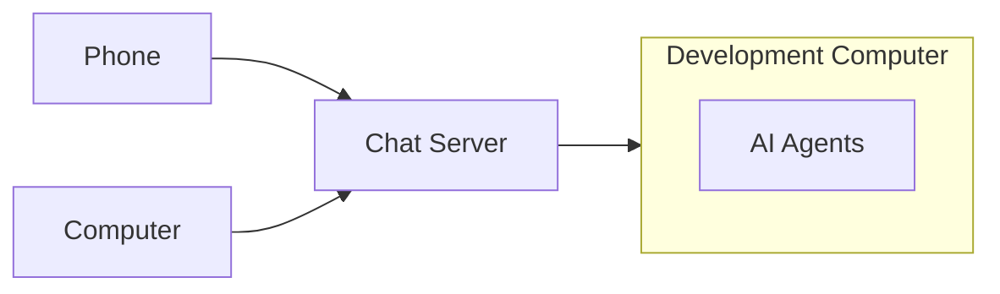
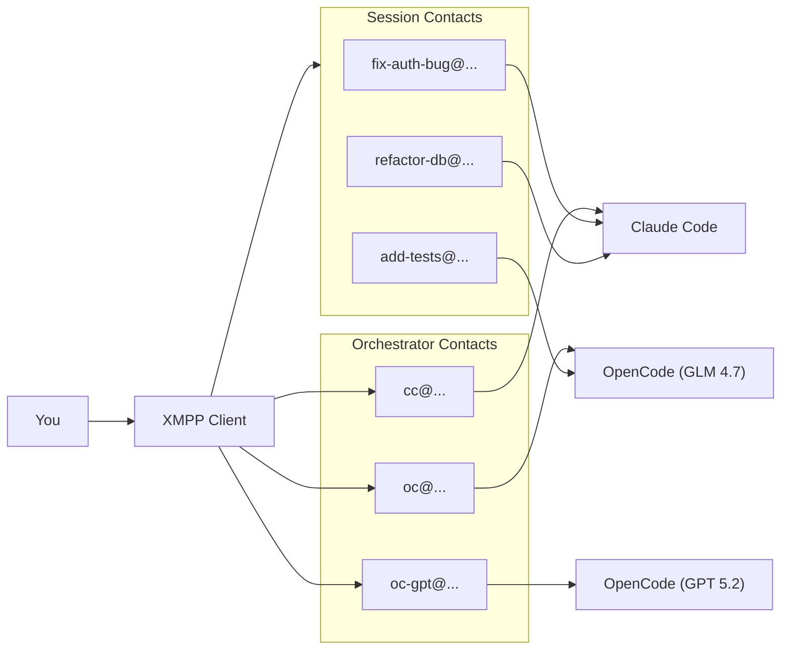

# Switch



Chat with AI coding assistants from any XMPP client. Each conversation becomes a separate contact, making it easy to manage multiple concurrent sessions from your phone or desktop.

Designed to run on a dedicated Linux machine (old laptop, mini PC, home server) so the AI has real system access to do useful work.

Switch is the calm center for a swarm of agents. Spin up multiple sessions at once, let them talk to each other, and keep every thread portable across phone and desktop. Your sessions are not tied to a single provider, so you keep the flexibility of multiple backends while still getting the muscle of agent harnesses. It is simple open source software tied together with the power of SOTA when desired.

## Features

- **Multi-session**: Each conversation is a separate XMPP contact
- **Multiple orchestrators**: Three contacts for different AI backends
- **Mobile-friendly**: Works with any XMPP client (Conversations, Gajim, Dino, etc.)
- **Session persistence**: Resume conversations after restarts
- **Ralph loops**: Autonomous iteration for long-running tasks
- **Shell access**: Run commands directly from chat
- **Local memory vault**: Gitignored notes under `memory/`

## Quick Start

```bash
# Install dependencies
uv sync

# Configure
cp .env.example .env
# Edit .env with your XMPP server details

# Agent instructions are symlinked to home (for Claude Code and OpenCode)
# Edit ~/switch/AGENTS.md - symlinks at ~/AGENTS.md and ~/CLAUDE.md point here

# Run
uv run python -m src.bridge
```

## Orchestrator Contacts

Each AI backend has its own XMPP contact. Message any of them to start a session:

| Contact | Backend | Model |
|---------|---------|-------|
| `cc@...` | Claude Code | Claude Opus |
| `oc@...` | OpenCode | GLM 4.7 |
| `oc-gpt@...` | OpenCode | GPT 5.2 |

Sessions appear as separate contacts (e.g., `fix-auth-bug@...`) so you can have multiple conversations in parallel.

## How It Works



## Basic Usage

| Action | Command |
|--------|---------|
| New Claude session | Message `cc@...` |
| New GLM session | Message `oc@...` |
| New GPT session | Message `oc-gpt@...` |
| Cancel current run | `/cancel` |
| Run shell command | `!git status` |
| List sessions | `/list` to any orchestrator |

## Documentation

- [Setup Guide](docs/setup.md) - Hardware, installation, configuration
- [Commands Reference](docs/commands.md) - All available commands
- [Architecture](docs/architecture.md) - How the system works
- [Memory Vault](docs/memory.md) - Store local learnings and runbooks
- [AGENTS.md](AGENTS.md) - Instructions for AI agents working on this codebase

## Requirements

- Dedicated Linux machine (bare metal preferred)
- Python 3.11+
- ejabberd XMPP server
- OpenCode CLI and/or Claude Code CLI
- tmux
- [Tailscale](https://tailscale.com/) (recommended for secure remote access)

## Models

- **cc**: Claude Opus via Claude Code CLI
- **oc**: GLM 4.7 via OpenCode - fast, cheap, good for iteration
- **oc-gpt**: GPT 5.2 via OpenCode - alternative for comparison

## License

MIT
