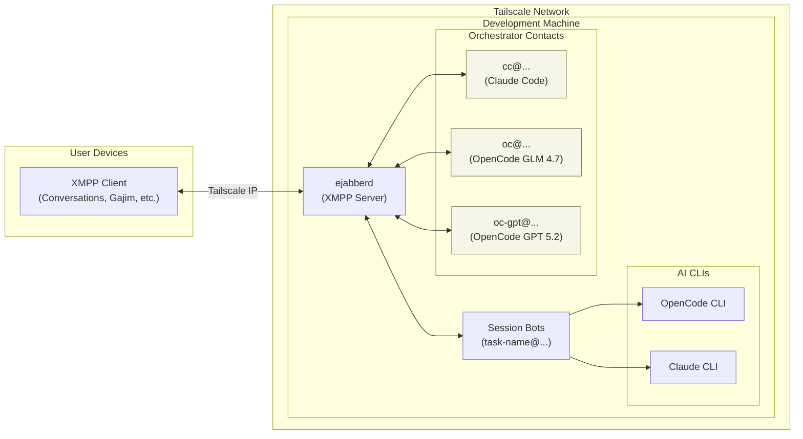
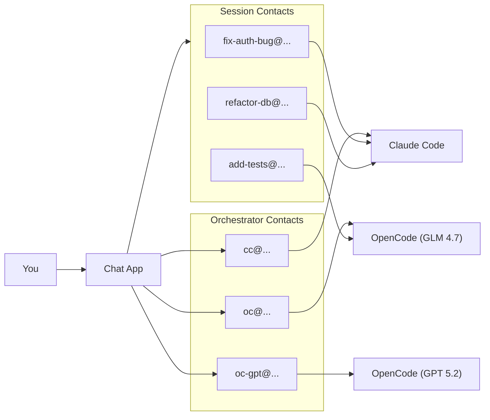

# Switch

<!-- DIAGRAM:system -->
<!-- (auto-generated by scripts/sync-diagrams.py; edit docs/diagrams/system.mermaid) -->

<!-- /DIAGRAM:system -->

Chat with AI coding assistants from any open source chat app.

## One Contact = One Session

Most AI chat systems (including [MoltBot](https://github.com/moltbot/moltbot)) give you a single bot contact. You talk to "the bot" and it manages sessions internally with commands like `/new` or `/reset`. Sessions exist, but they're invisible — hidden behind one conversational interface.

Switch inverts this. Every session is a separate XMPP contact in your roster:

```
fix-auth-bug@dev.local
refactor-db@dev.local
add-tests@dev.local
```

This is not a cosmetic difference. It changes how you work:

- **Parallel conversations are native.** Three sessions means three chat windows, not one window with context-switching commands. Your chat app's UI — tabs, notifications, unread counts — now manages your agent swarm.
- **Sessions are portable.** Open a session on your phone, continue on desktop. Each contact syncs independently through your XMPP client.
- **Sessions can message each other.** An agent can spawn a child session and receive its results as XMPP messages. Coordination happens through the same protocol you use.
- **History is per-contact.** Scroll up in any session to see its full history. No single bot log to grep through.

Under the hood, Switch uses **XMPP** — an open chat protocol (the same one that powers Google Talk, WhatsApp's backend, etc.). You don't need to know or care about the protocol. All it means in practice is that you pick a free, open source chat app — [Conversations](https://conversations.im/) on Android, [Monal](https://monal-im.org/) on iOS, and on desktop the XMPP client of choice is [switch-mac-os](https://github.com/0xrin1/switch-mac-os/tree/main) (macOS). [Gajim](https://gajim.org/) and [Dino](https://dino.im/) also work.

This project is heavily vibe coded and heavily WIP. Expect rough edges and breaking changes.

No vendor lock-in. No proprietary client. Just a normal chat app you already know how to use.

Designed to run on a dedicated Linux machine (old laptop, mini PC, home server) so the AI has real system access to do useful work.

## Features

- **Multi-session**: Each conversation is a separate chat contact
- **Multiple orchestrators**: Multiple contacts for different AI backends
- **Mobile-friendly**: Works with any open source chat app (Conversations, Monal, Gajim, Dino, etc.)
- **Session persistence**: Resume conversations after restarts
- **Ralph loops**: Autonomous iteration for long-running tasks
- **Shell access**: Run commands directly from chat
- **Local memory vault**: Gitignored notes under `memory/`

## Quick Start

```bash
# Install dependencies
uv sync

# Install git hooks (optional but recommended)
./scripts/install-pre-commit.sh

# Configure
cp .env.example .env
# Edit .env with your chat server details

# Agent instructions are symlinked to home (for Claude Code and OpenCode)
# Edit ~/switch/AGENTS.md - symlinks at ~/AGENTS.md and ~/CLAUDE.md point here

# Run
uv run python -m src.bridge
```

If you're using OpenCode orchestrators (`oc@...`, `oc-gpt@...`, etc.), make sure the OpenCode server is running locally (Switch connects over HTTP + SSE).

## Running as Services (systemd --user)

Switch is commonly run as a user service alongside an OpenCode server:

```bash
# Start/restart Switch (XMPP bridge)
systemctl --user restart switch

# Start/restart OpenCode server (HTTP + SSE)
systemctl --user restart opencode

# Follow logs
journalctl --user -u switch -f
journalctl --user -u opencode -f
```

## OpenCode Streaming and Progress Updates

OpenCode sessions stream output and tool events over SSE. If a session looks "stuck", it's often one of:

- **No SSE events** (progress/tool updates don't arrive)
- **Long-running calls** (you may only get a final response unless tool progress is enabled)

Useful env vars (set in `.env`, then restart `switch.service`):

- `OPENCODE_HTTP_TIMEOUT_S`: Total HTTP timeout for long runs
- `OPENCODE_SSE_CONNECT_TIMEOUT_S`: How long to wait when establishing the SSE stream
- `SWITCH_LOG_TOOL_INPUT=1`: Include tool inputs (e.g., bash commands) in progress pings
- `SWITCH_LOG_TOOL_INPUT_MAX`: Cap tool-input preview length

## Orchestrator Contacts

Each AI backend shows up as a contact in your chat app. Message any of them to start a session:

| Contact | Backend | Model |
|---------|---------|-------|
| `cc@...` | Claude Code | Claude Opus |
| `oc@...` | OpenCode | GLM 4.7 |
| `oc-gpt@...` | OpenCode | GPT 5.2 |
| `oc-glm-zen@...` | OpenCode | GLM 4.7 (Zen) |
| `oc-gpt-or@...` | OpenCode | GPT 5.2 (OpenRouter) |
| `oc-kimi-coding@...` | OpenCode | Kimi K2.5 (Kimi for Coding) |

Sessions appear as separate contacts (e.g., `fix-auth-bug@...`) so you can have multiple conversations in parallel.

## How It Works



## Basic Usage

| Action | Command |
|--------|---------|
| New Claude session | Message `cc@...` |
| New GLM session | Message `oc@...` |
| New GPT session | Message `oc-gpt@...` |
| Cancel current run | `/cancel` |
| Run shell command | `!git status` |
| List sessions | `/list` to any orchestrator |

## Documentation

- [Setup Guide](docs/setup.md) - Hardware, installation, configuration
- [Commands Reference](docs/commands.md) - All available commands
- [Architecture](docs/architecture.md) - How the system works
- [Memory Vault](docs/memory.md) - Store local learnings and runbooks
- [AGENTS.md](AGENTS.md) - Instructions for AI agents working on this codebase

## Requirements

- Dedicated Linux machine (bare metal preferred)
- Python 3.11+
- [ejabberd](https://www.ejabberd.im/) (open source chat server)
- OpenCode CLI and/or Claude Code CLI
- tmux
- [Tailscale](https://tailscale.com/) (recommended for secure remote access)

## Models

- **cc**: Claude Opus via Claude Code CLI
- **oc**: GLM 4.7 via OpenCode - fast, cheap, good for iteration
- **oc-gpt**: GPT 5.2 via OpenCode - alternative for comparison
- **oc-kimi-coding**: Kimi K2.5 via Kimi for Coding

## License

MIT
