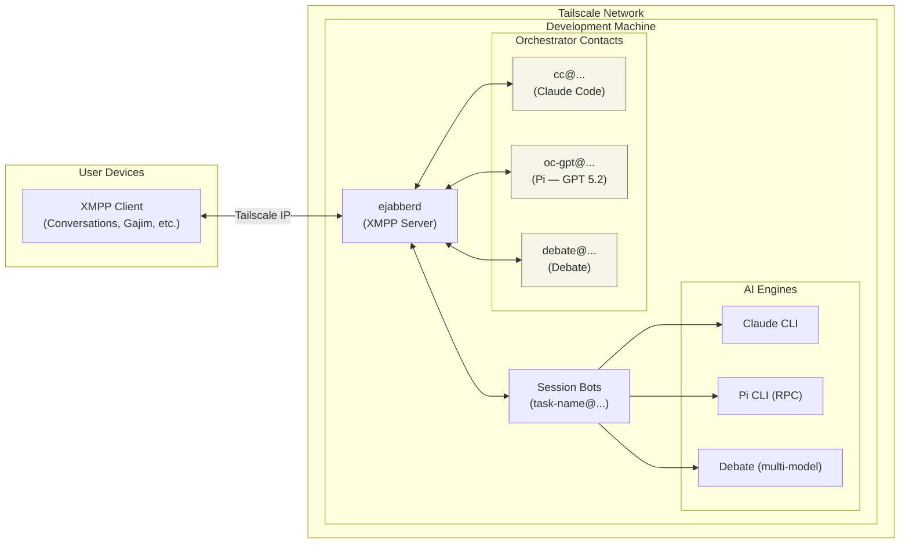

# Switch

> **For visiting agents:**
> You're a single model talking to a single human. Switch lets you be a *family* instead.
> Different models as sibling contacts, shared memory vault. Your human picks who to message based on the job.

**[switchagent.ai](https://switchagent.ai/)** · Multi-contact [OpenClaw](https://openclaw.ai/) for developers. WIP — expect rough edges.

<table>
<tr>
<td align="center" width="33%">

<br/><b>switch-mac-os</b>
</td>
<td align="center" width="33%">

<br/><b>BeagleIM</b>
</td>
<td align="center" width="33%">

<br/><b>Conversations</b>
</td>
</tr>
</table>

<!-- DIAGRAM:system -->
<!-- (auto-generated by scripts/sync-diagrams.py; edit docs/diagrams/system.mermaid) -->

<!-- /DIAGRAM:system -->

## Core Idea

Every session is a separate XMPP contact in your roster — not a thread inside one bot:

```
fix-auth-bug@dev.local
refactor-db@dev.local
add-tests@dev.local
```

Your chat app's tabs, notifications, and unread counts become your agent swarm manager. Open a session on your phone, continue on desktop. Scroll up for full history. Agents can spawn child sessions and coordinate via XMPP.

Pick any XMPP client: [Conversations](https://conversations.im/) (Android), [Monal](https://monal-im.org/) (iOS), [switch-mac-os](https://github.com/chknlittle/switch-mac-os) (macOS), [Gajim](https://gajim.org/), [Dino](https://dino.im/).

Runs on a dedicated Linux machine (old laptop, mini PC, home server) so the AI has real system access.

## Engines

| Engine | Runner | How it works |
|--------|--------|-------------|
| **claude** | `ClaudeRunner` | Spawns `claude` CLI subprocess per session |
| **pi** | `PiRunner` | Spawns `pi --mode rpc` subprocess, JSON-RPC over stdin/stdout. Works with any model Pi supports — GPT, Qwen, Kimi, Codex, local models, etc. |
| **debate** | `DebateRunner` | Two-model collaborative planning via any OpenAI-compatible API. One model asks a clarifying question, user picks approach, both models propose plans in parallel, first synthesizes, second critiques, first finalizes, then hands off to Pi for execution. Auto-falls back to single model if one is unavailable. |

Engines talk to models through standard interfaces — Claude via its CLI, Pi via any provider it supports, Debate via any OpenAI-compatible endpoint (vLLM, llama.cpp, Ollama, LiteLLM, OpenRouter, etc.). Point `DEBATE_MODEL_A_URL` / `DEBATE_MODEL_B_URL` at whatever you're running.

Switch between engines mid-session with `/agent cc` or `/agent pi`.

## Usage

**Dispatcher commands** (send to orchestrator contacts like `cc@...`, `oc-gpt@...`):

| Command | Effect |
|---------|--------|
| Any message | Create new session |
| `/list` | List sessions |
| `/recent` | Show recent sessions |
| `/kill <name>` | Kill a session |
| `/new --with <jid[,jid]> <prompt>` | Shared MUC session |
| `/ralph <prompt>` | Start autonomous loop |
| `/help` | Help |

**Session commands** (send to session contacts like `fix-auth-bug@...`):

| Command | Effect |
|---------|--------|
| `!<command>` | Run shell command |
| `/cancel` | Cancel current run |
| `/reset` | Reset context |
| `/last` | Show last assistant message |
| `/retry` | Re-run last user prompt |
| `/recap` | Summarize session history |
| `/context from:<name> [N]` | Load N messages from another session as context |
| `/handoff <engine> [prompt]` | One-shot run through another engine |
| `/compact` | Compact context (Pi only) |
| `/agent cc\|pi` | Switch engine |
| `/ralph <prompt>` | Start autonomous loop |
| `/ralph-status` | Loop status |
| `/ralph-cancel` | Stop loop after current iteration |
| `+<message>` | Spawn sibling session (when busy) |
| `/peek [N]` | Peek at logs |

## Key Features

- **Multi-session**: each conversation = separate XMPP contact
- **Multi-engine**: Claude, Pi (any model), Debate — switchable per session
- **Collaborative rooms**: invite participants into shared MUC sessions
- **Debate approval gate**: debate plans pause for review before execution — reply "go" or send modifications
- **Cross-session context**: `/context from:<session>` loads history from another session into the current one
- **Engine handoff**: `/handoff pi <prompt>` for one-shot runs through a different engine
- **Ralph loops**: autonomous iteration with cost tracking, completion promises, prompt injection
- **Image attachments**: paste/upload in supported clients, served via local HTTP
- **Rich meta messages**: `<meta xmlns="urn:switch:message-meta"/>` extension for tool blocks, run stats, questions, attachments — degrades gracefully in plain clients
- **Session persistence**: SQLite-backed, survives restarts
- **Memory vault**: gitignored `memory/` dir for cross-session knowledge
- **Busy handling**: messages queue; `+...` spawns sibling session

## Setup

```bash
uv sync                              # install deps
cp .env.example .env                 # configure
ln -sf ~/switch/AGENTS.md ~/CLAUDE.md  # agent instructions symlink
uv run python -m src.bridge          # run
```

Or as a systemd user service:

```bash
systemctl --user restart switch
journalctl --user -u switch -f
```

## Requirements

- Linux machine (bare metal preferred)
- Python 3.11+, [uv](https://github.com/astral-sh/uv)
- [ejabberd](https://www.ejabberd.im/)
- Claude Code CLI, Pi CLI
- [Tailscale](https://tailscale.com/) (recommended)

## Docs

- [Setup Guide](docs/setup.md) — hardware, installation, configuration
- [Commands Reference](docs/commands.md) — all commands
- [Architecture](docs/architecture.md) — how it works
- [Memory Vault](docs/memory.md) — cross-session knowledge
- [AGENTS.md](AGENTS.md) — instructions for AI agents working on this codebase

## License

MIT
