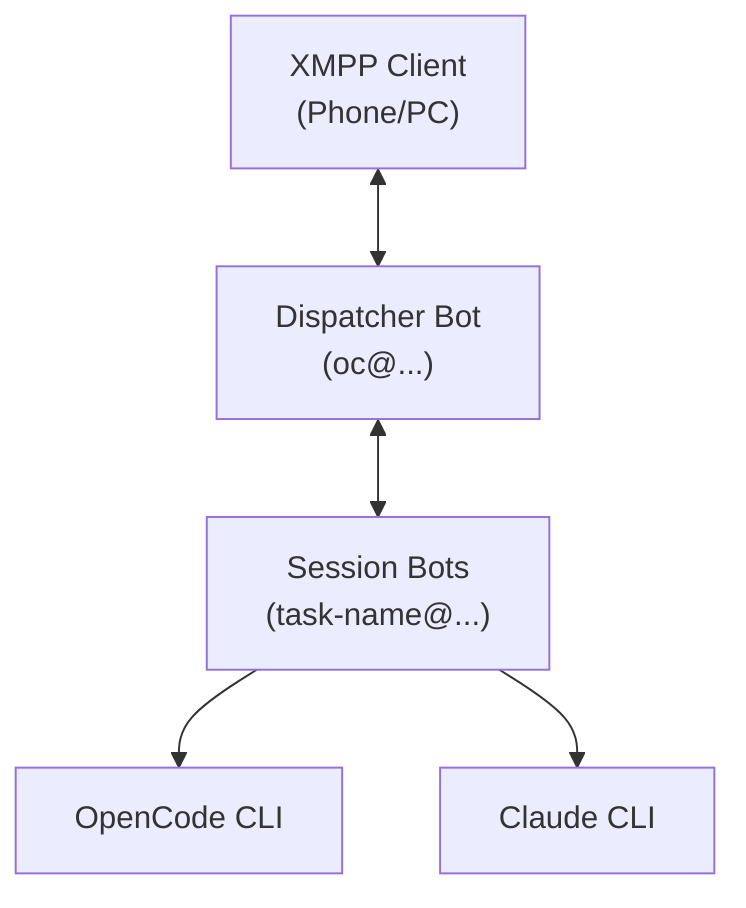

# Architecture

## Overview

Switch creates a chat-based interface for AI coding assistants. Each conversation session becomes a separate XMPP contact, allowing you to manage multiple concurrent AI conversations from any XMPP client (Conversations, Gajim, Dino, etc.).

The codebase lives at `~/switch`. AI agents working on this project should reference `~/switch/AGENTS.md` for conventions and `~/switch/memory/` for persistent context.



## Components

### Dispatcher Bot (`oc@domain`)

The entry point. Send any message here to create a new session. Handles:

- Session creation with auto-generated names from message content
- Global commands (`/list`, `/kill`, `/recent`, `/help`)
- Optional integrations (calendar, telegram)

### Session Bots (`session-name@domain`)

One bot per conversation. Each session:

- Has its own XMPP account (created dynamically via ejabberdctl)
- Maintains conversation context with the AI backend
- Can switch between OpenCode and Claude engines
- Tracks costs, tokens, and tool usage

### Session Manager

Coordinates all bots:

- Starts/stops session bots
- Restores active sessions on restart
- Manages XMPP account lifecycle

## Data Flow

1. **New Session**: Message to dispatcher → slugify name → create XMPP account → spawn SessionBot → process first message

2. **Continuing Session**: Message to session contact → SessionBot receives → run AI backend → stream response back

3. **Session Output**: All AI output logged to `~/switch/output/<session>.log` for debugging and `/peek` command

## Database Schema

SQLite database (`~/switch/sessions.db`) stores:

```sql
sessions (
    name TEXT PRIMARY KEY,        -- e.g., "fix-auth-bug"
    xmpp_jid TEXT,                -- e.g., "fix-auth-bug@domain"
    xmpp_password TEXT,
    claude_session_id TEXT,       -- For resuming Claude conversations
    opencode_session_id TEXT,     -- For resuming OpenCode conversations
    active_engine TEXT,           -- "opencode" or "claude"
    model_id TEXT,                -- OpenCode model selection
    status TEXT                   -- "active" or "closed"
)
```

## AI Backends

### OpenCode

- Runs `opencode run --format json`
- Parses streaming JSON events
- Supports model selection and reasoning modes
- Tracks detailed token usage

### Claude Code

- Runs `claude -p --output-format stream-json`
- Parses streaming JSON events
- Uses Opus model
- Supports session resumption

## Ralph Loop

Autonomous iteration system for long-running tasks:

```
/ralph 20 Fix all type errors
```

Runs the AI in a loop until:
- Max iterations reached
- Completion promise detected in output
- Manual cancellation via `/ralph-cancel`
